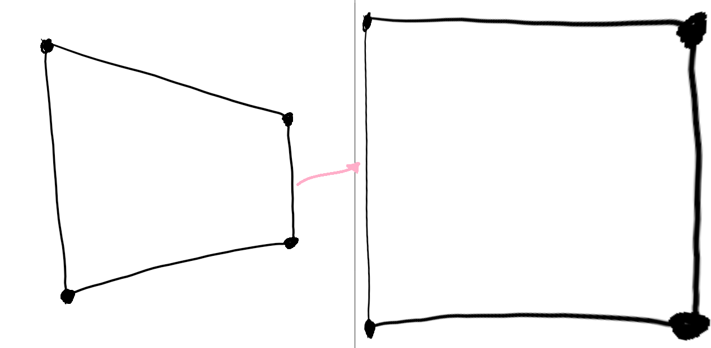

# perspective-transform
Transform a perspective of a distorted image using OpenCV (e.g. turn a distorted frame into a rectangle).

## Demo


## How to use
install the requirements using:
```
pip install -r requirements.txt
```
and then run the script
```
python pt-rect.py
```
